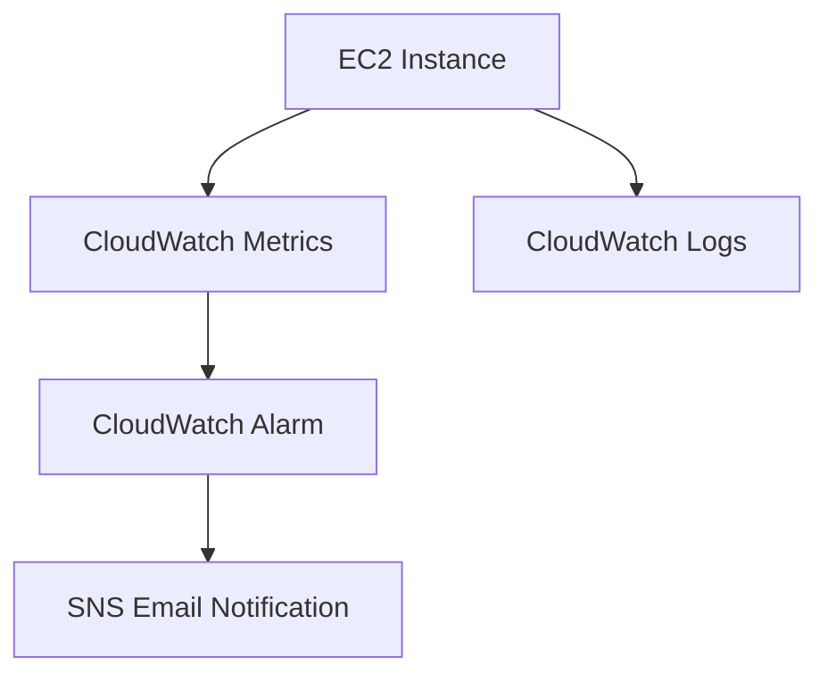

# Project 3 — EC2 Monitoring & Alerts (CloudWatch + SNS)

AWS CloudWatch • Monitoring • Alerts • SNS Notifications • EC2 Metrics
Level: Cloud Practitioner • Status: In Progress • License: MIT

---

## Table of Contents

* Overview
* Architecture
* What You Will Build
* AWS Services Used
* Project Structure
* Deployment Steps
* Key Deliverables
* Security Best Practices
* Future Enhancements
* License
* Author

---

## Overview

This project demonstrates how to monitor an EC2 instance using CloudWatch Metrics, CloudWatch Logs, and SNS email alerts.
You will configure metric alarms, real-time notifications, and optional system log collection.

This project reflects AWS Cloud Practitioner competencies across: Monitoring, Logging, Alerts, Compute, IAM, and Operations.

---

## Architecture

Refer to the architecture file here: architecture-diagram.md

High-Level Flow:

1. EC2 generates metrics and logs
2. CloudWatch collects CPU and system-level data
3. CloudWatch Alarm evaluates thresholds
4. SNS sends email notifications when the alarm triggers

Mermaid Diagram:

---

## What You Will Build

* EC2 instance with monitoring enabled
* CloudWatch Metrics (CPU usage, network, status checks)
* CloudWatch Alarm with threshold configuration
* SNS Topic and email subscription
* Optional: CloudWatch Logs for deeper observability

---

## AWS Services Used

EC2 – Instance to monitor
CloudWatch Metrics – Collects performance data
CloudWatch Logs – Optional log storage
CloudWatch Alarms – Threshold-based alerting
SNS – Email-based notifications
IAM – Permissions for EC2 monitoring and CloudWatch agent

---

## Project Structure

project-3-cloudwatch-monitoring-alerts/
├── README.md
├── architecture-diagram.md
├── steps.md
└── notes.md

---

## Deployment Steps

The full step-by-step guide is available in steps.md.

---

## Key Deliverables

* Monitoring-enabled EC2 instance
* CloudWatch alarm triggering based on CPU threshold
* SNS email notification workflow
* Optional CloudWatch logs
* Fully documented GitHub project

---

## Security Best Practices

* Use IAM roles for EC2 instead of access keys
* Confirm SNS subscription before use
* Restrict EC2 inbound rules
* Apply least-privilege IAM policies

---

## Future Enhancements

* Add CloudWatch Dashboards
* Add multi-metric alarms (memory, disk, network)
* Use EventBridge for automated recovery
* Enable CloudWatch Agent for detailed monitoring
* Create Auto Scaling policies based on CloudWatch alarms

---

## License

This project is licensed under the MIT License.

---

## Author

Vignesh Ganesan
AWS Certified Cloud Practitioner — Score: 1000/1000

---

