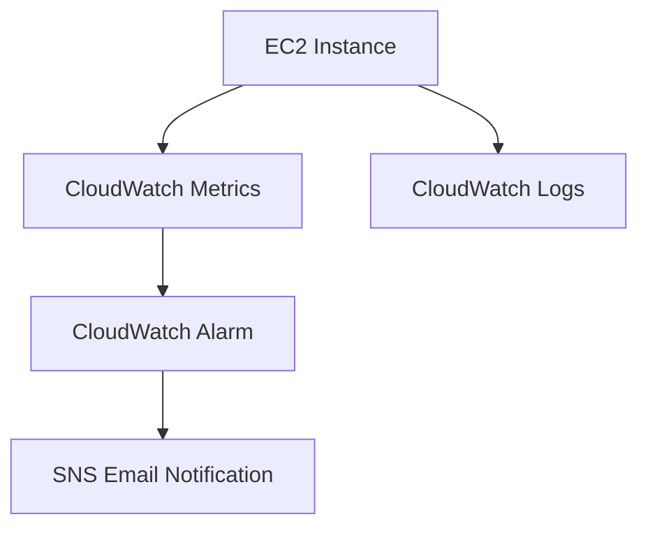

# Project 3 — Architecture Diagram

This architecture shows how CloudWatch monitors an EC2 instance and sends alerts through SNS.
CloudWatch collects EC2 metrics, evaluates alarm thresholds, and notifies users when values exceed configured limits.

---

## High-Level Architecture (Mermaid Diagram)

---

## Components

### EC2 Instance

The compute resource that generates CPU, network, and status check metrics.

### CloudWatch Metrics

Automatically collects CPUUtilization, DiskReadOps, NetworkIn, and more.
Optional: CloudWatch Agent can provide memory metrics.

### CloudWatch Logs

Stores system logs or custom application logs from EC2.

### CloudWatch Alarm

Evaluates thresholds (e.g., CPU > 70% for 5 minutes).
Triggers notification when threshold is breached.

### SNS (Simple Notification Service)

Sends email alerts to subscribed email addresses when a CloudWatch alarm triggers.

---

## Data Flow Summary

1. EC2 instance generates metrics and logs
2. CloudWatch collects and stores the data
3. Alarm monitors specific metrics
4. When threshold is exceeded, the alarm enters **ALARM** state
5. SNS sends an email notification
6. User receives the alert in their inbox

---

This architecture provides visibility, health monitoring, and alerting for EC2 instances using AWS CloudWatch.

---
