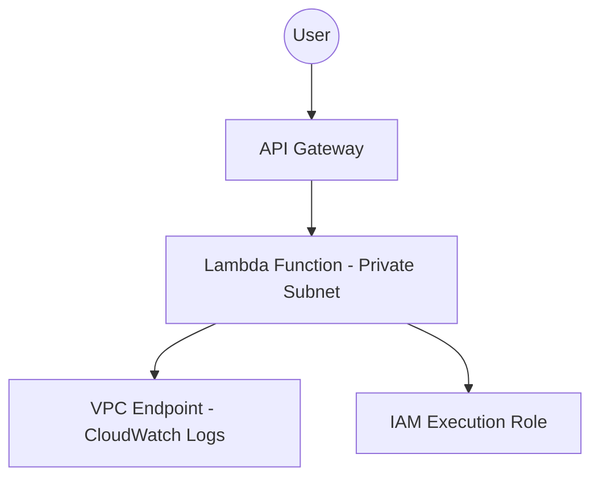

---

# Project 4 — Serverless API (API Gateway + Lambda + Private VPC)

This project demonstrates how to build a secure serverless REST API using API Gateway and AWS Lambda running inside a private VPC subnet.
The Lambda function has no internet access and uses a VPC Endpoint to send logs to CloudWatch.

This setup reflects Cloud Practitioner-level concepts in Serverless, VPC Networking, IAM Roles, API Gateway, and CloudWatch logging.

---

## Table of Contents

* Overview
* Architecture
* What You Will Build
* AWS Services Used
* Project Structure
* Deployment Steps
* Key Deliverables
* Security Best Practices
* Future Enhancements
* License
* Author

---

## Overview

This project shows how API Gateway triggers a Lambda function located in a private subnet.
Because the Lambda cannot access the internet, all logging is handled through a **VPC Endpoint** that connects privately to CloudWatch Logs.

This architecture demonstrates:

* Serverless API development
* Private VPC networking
* VPC Endpoints
* CloudWatch logging
* IAM permissions

---

## Architecture

Refer to: architecture-diagram.md

High-Level Flow:

1. The user sends a request to API Gateway
2. API Gateway invokes the Lambda function
3. Lambda runs inside a private subnet
4. Lambda sends logs to CloudWatch through a VPC Endpoint
5. IAM Role controls Lambda execution permissions

Mermaid Diagram:

---

## What You Will Build

* A public HTTPS API endpoint via API Gateway
* A Lambda function running inside a private subnet
* A VPC with public and private subnets
* A VPC Endpoint for CloudWatch Logs
* Correct IAM Execution Role for Lambda
* A working GET API returning a simple JSON response

---

## AWS Services Used

API Gateway — Public entry point for the API
Lambda — Serverless compute running in private subnet
VPC — Provides network isolation
VPC Endpoint — Allows CloudWatch Logs access privately
CloudWatch Logs — Stores Lambda logs
IAM — Secure role for Lambda execution

---

## Project Structure

project-4-serverless-api-lambda-vpc/
├── README.md
├── architecture-diagram.md
├── steps.md
├── lambda/
│   └── lambda_function.py
└── notes.md

---

## Deployment Steps

Complete instructions are available in steps.md.

---

## Key Deliverables

* A functioning serverless API
* Lambda isolated in a private subnet
* CloudWatch logs accessible through VPC Endpoint
* IAM role configured with least privileges
* A clean and secure architecture

---

## Security Best Practices

* Lambda placed in a private subnet (no internet)
* Only required permissions in IAM role
* VPC Endpoint used instead of NAT Gateway
* API Gateway enforces HTTPS
* No public access to internal resources

---

## Future Enhancements

* Add more API routes (POST, PUT, DELETE)
* Integrate DynamoDB for data storage
* Add authentication using API Keys or Cognito
* Add IaC version using Terraform or CloudFormation

---

## License

This project is licensed under the MIT License.

---

## Author

Vignesh Ganesan
AWS Certified Cloud Practitioner — Score: 1000/1000

---
