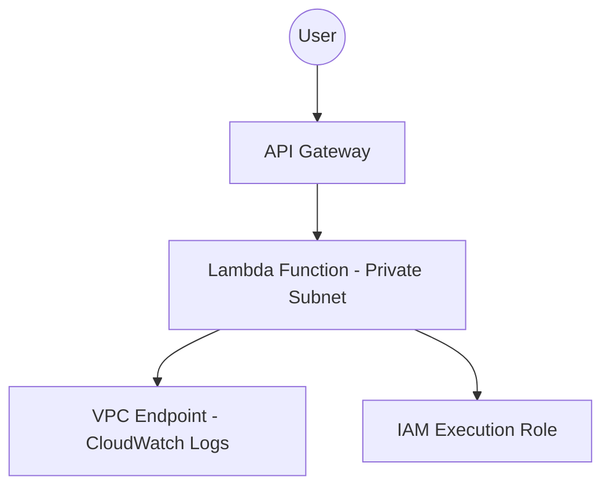

---

# Project 4 — Architecture Diagram

This architecture shows how API Gateway invokes a Lambda function running inside a private VPC subnet.
Because the Lambda function does not have internet access, all CloudWatch Logs traffic is routed through a VPC Endpoint.
IAM provides the execution role permissions required for logging.

---

## High-Level Architecture (Mermaid Diagram)

---

## Components

### API Gateway

Provides a public HTTPS endpoint for the API.
Forwards requests to the Lambda function.

### Lambda Function (Private Subnet)

Runs application logic inside a private subnet with **no internet access**.
Uses an IAM role for permissions.

### VPC Endpoint (CloudWatch Logs)

Allows Lambda to write logs to CloudWatch without leaving the VPC.
Prevents the need for NAT Gateway or public internet access.

### IAM Execution Role

Grants Lambda permission to write logs to CloudWatch.
Follows least-privilege access.

---

## Data Flow Summary

1. A user sends an HTTPS request to API Gateway
2. API Gateway triggers the Lambda function
3. Lambda runs inside a private subnet
4. Lambda writes logs to CloudWatch through a VPC Endpoint
5. IAM execution role authorizes the logging actions

---

This architecture demonstrates a secure and private serverless API using AWS best practices.

---

